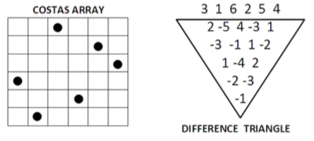

A costas array is a pattern of $n$ marks on an $n * n$ grid, one mark per row and one per column, in which the $n*(n - 1)/2$ vectors between the marks are all-different.

Such patterns are important as they provide a template for generating radar and sonar signals with ideal ambiguity functions.

A model for Costas Array Problem (CAP) is to define an array of variables $X_1,...,X_n$ which form a permutation.
For each length $l \in \\{1,...,n - 1\\}$, we add $n-l$ more variables $X^l_1$ $1,...,X^l_{n-1}$, whereby each of these variables is assigned the difference of $X_i - X_{i+l}$ for $i \in \\{1,...,n - l\\}$.
These additional variables form a difference triangle as shown in the figure below.

Each line of this difference triangle must not contain any value twice.
That is, the CAP is simply a collection of all-different constraints on $X_1,...,X_n$ and $X^l_1 ...,X^l{n-l}$ for all $l \in \\{1,...,n - 1\\}$.

Costas arrays can be constructed using the generation methods based on the theory of finite fields for infinitely many $n$.
However, there is no construction method for all $n$ and it is, e.g., unknown whether there exists a Costas Array of order 32.

The problem description was taken from cite{kadioglu2009dialectic} with small adaptations.

For a related problem, please see {prob006}.

Here is a website which contains some more information on the problem: http://datagenetics.com/blog/february22013

There was a dedicated website for the Costas Arrays Problem (http://www.costasarrays.org), but it doesn't seem accesible any more. It can be found on the [Wayback Machine](https://web.archive.org/web/20120206033000/http://www.costasarrays.org/).

Helmut Simonis has slides on Costas Arrays here: http://4c.ucc.ie/~hsimonis/ELearning/costas/slides.pdf

